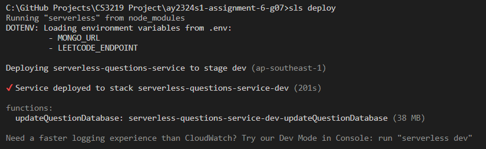
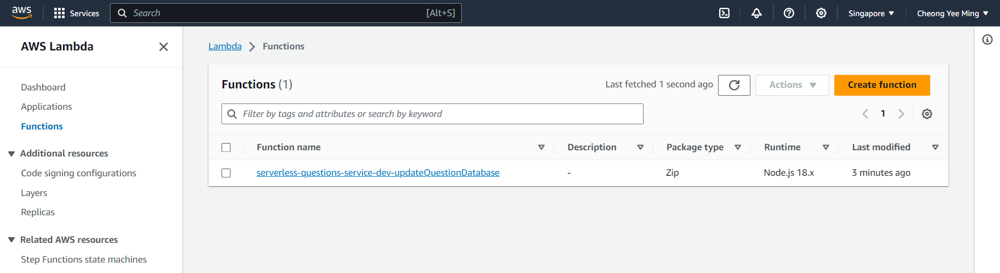
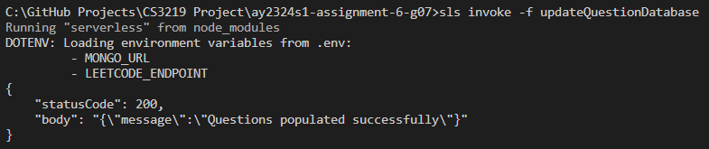
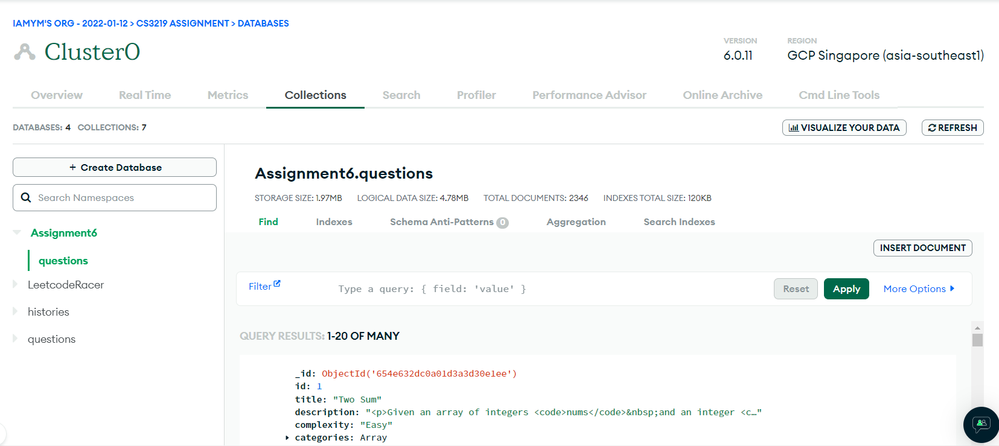

# Getting Started

In order to run this assignment, you will need the following:

1. AWS Free Tier Account
2. AWS CLI
3. MongoDB Account

Follow the steps below in sequential order to setup this assignment!

## Step 1: Create a Database and Collection

Login into MongoDB Atlas [here](https://www.mongodb.com/cloud/atlas).

Next, create a Database in your free cluster with the following inputs.

1. Database name: `Assignment6`
2. Collection name: `questions`


Click on `Create` and you should be able to see an empty Database in your cluster.

## Step 2: Local Setup

Firstly, you will need to install Serverless locally. You may skip this step if already have Serverless.

```
npm install -g serverless
```

The above command will install the Serverless Frameworok, which is used to build this serverless function on AWS.

Next, git clone the entire repository with the following command.

```
git clone https://github.com/CS3219-AY2324S1/ay2324s1-assignment-6-g07.git
```

### Environment Variables

Create a `.env` file in the root directory using `touch .env`.

Copy the contents below into your `.env` file.

```
MONGO_URL='mongodb+srv://<username>:<password>@cluster0.j1a3k0n.mongodb.net/Assignment6?retryWrites=true&w=majority'
LEETCODE_ENDPOINT='https://leetcode.com/graphql'
```

Replace `<username>` with your own MongoDB username and `<password>` with your own MongoDB password.

### AWS Configuration

You should have AWS CLI installed locally. If not, you can download it [here](https://docs.aws.amazon.com/cli/latest/userguide/getting-started-install.html).

Open a new terminal and key in the following command.

```
aws configure
```

The terminal should prompt you to provide the following information:

1. `AWS Access Key ID`: This is the access key for your AWS account
2. `AWS Secret Access Key`: This is the secret key for your AWS account
3. `Default region name`: For this field, you should use `ap-southeast-1`
4. `Default output format`: You can leave this field blank

You can retrieve your access and secret keys from your [AWS Management Console](https://console.aws.amazon.com/iam/home#/security_credentials).

### Install Node Packages

Finally, you can run `npm i` to install all the required dependencies.

## Step 3: Deployment

You should have Serverless installed at this point.

In your terminal, run the command below to deploy the function to AWS Lambda.

```
sls deploy
```

Upon successful deployment, you should see the following in your terminal.



Similarly, you should be able to see the deployed function in your [AWS Lambda Functions](https://ap-southeast-1.console.aws.amazon.com/lambda/home?region=ap-southeast-1#/functions).



## Step 4: Invoke Function

The function is set to be invoked every 24 hours but for the sake of testing you can run the following command and invoke the function immediately.

```
sls invoke -f updateQuestionDatabase
```

It will take about 2 minutes.

Upon successful invocation, you should see the following in your terminal.



Similarly, if you refresh your MongoDB Atlas, you should see a populated questions collection.



```

```
