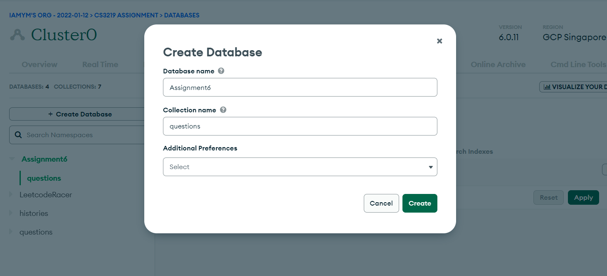

# Getting Started

In order to test the serverless function, you will need to

## Create a Database and Collection

You should be able to login into MongoDB Atlas [here](https://www.mongodb.com/cloud/atlas).
Next, create a Database in your free cluster:
